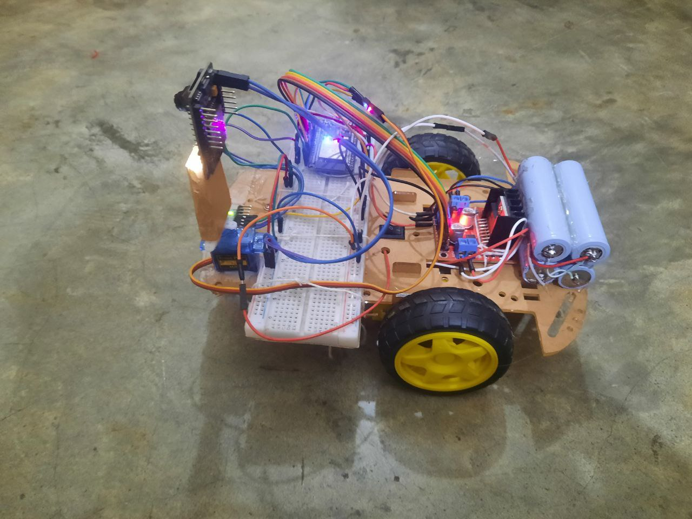
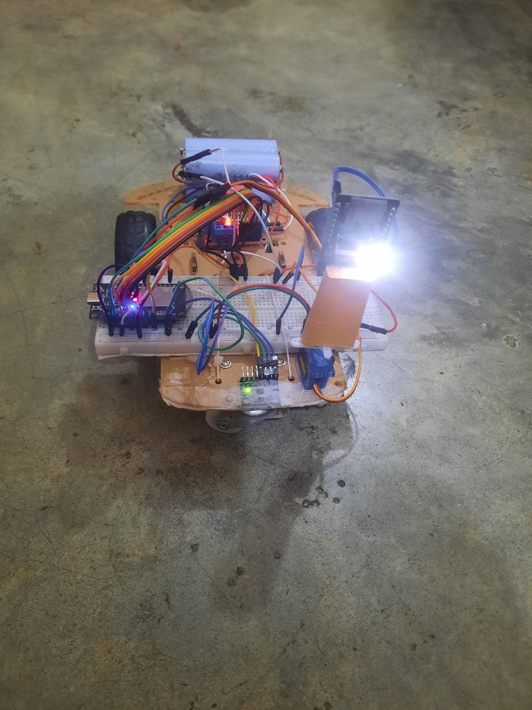
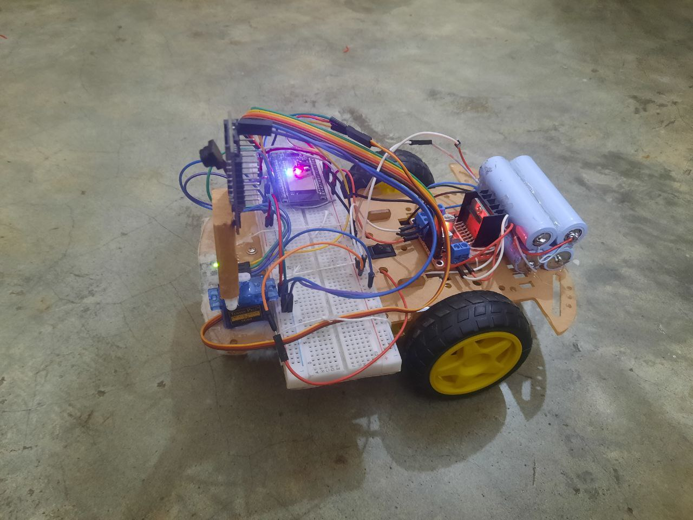
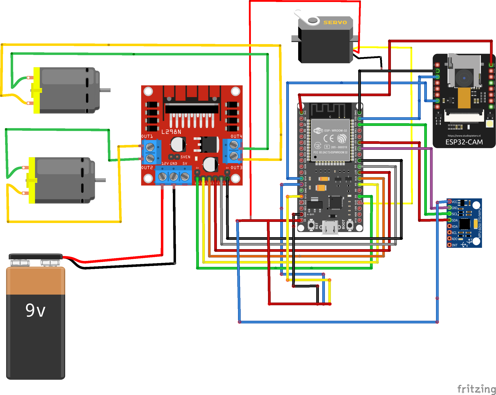

### CaveEye – A Wireless Surveillance Robot with Real-Time Imaging and PID-Based Navigation.
You can find the full code for this project.

### Images
<table>
  <tr>
    <td></td>
    <td></td>
  </tr>
  <tr>
    <td></td>
    <td></td>
  </tr>
</table>

### Circuit Diagram

